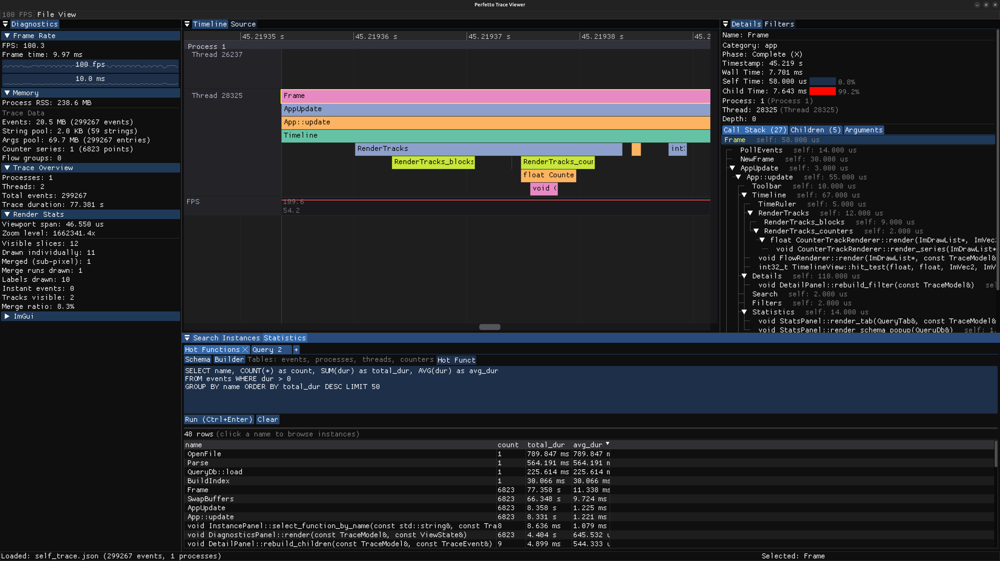
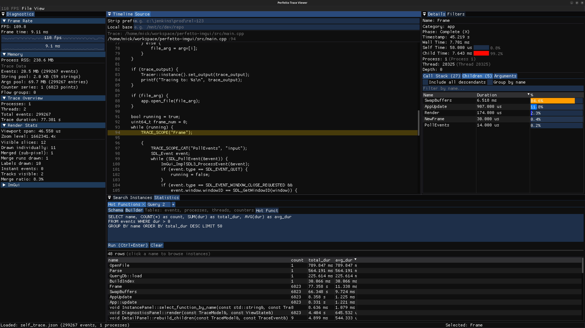
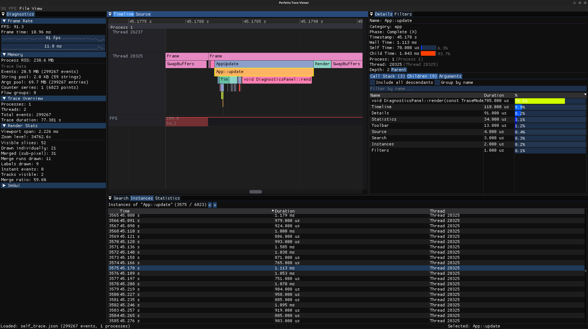

# Perfetto Trace Viewer

A fast, native Chrome trace viewer built with C++ and [Dear ImGui](https://github.com/ocornut/imgui).





## Features

- **Timeline** - Zoomable/pannable timeline with colored slices per process/thread
- **Detail panel** - Event metadata, call stack, children breakdown, and JSON arguments
- **Source viewer** - Jump to source code for traced functions with syntax highlighting
- **SQL queries** - Query trace events with SQL and view results in sortable tables
- **Statistics** - Per-function aggregated timing with count, total, avg, min, max
- **Search** - Case-insensitive search by event name or category with result navigation
- **Filtering** - Toggle visibility of processes, threads, and categories
- **Counter tracks** - Step-function line charts for counter (ph:C) events
- **Flow arrows** - Bezier curves connecting flow events across threads
- **Native file dialog** - OS file picker via SDL3, plus drag & drop support
- **Resizable label gutter** - Drag the splitter to resize thread labels
- **Keyboard shortcuts** - WASD zoom/pan, arrow keys, F to fit, Escape to deselect

## Supported Format

[Chrome JSON Trace Event Format](https://docs.google.com/document/d/1CvAClvFfyA5R-PhYUmn5OOQtYMH4h6I0nSsKchNAySU) - both array (`[...]`) and object (`{"traceEvents": [...]}`) formats.

Supports event phases: X (complete), B/E (duration begin/end), i (instant), C (counter), s/t/f (flow), M (metadata), b/e/n (async).

## Building

Requires CMake 3.24+, a C++17 compiler, and OpenGL development headers.

```bash
# Install dependencies (Ubuntu/Debian)
sudo apt install build-essential cmake libgl-dev

# Build
cmake -B build -DCMAKE_BUILD_TYPE=Release
cmake --build build -j$(nproc)
```

All other dependencies (SDL3, Dear ImGui, nlohmann/json) are fetched automatically via CMake FetchContent.

## Usage

```bash
# Open with file dialog
./build/perfetto_imgui

# Open a trace file directly
./build/perfetto_imgui trace.json
```

You can also drag & drop a trace file onto the window.

### Controls

| Action | Input |
|--------|-------|
| Zoom in/out | Mouse wheel |
| Pan horizontally | Middle-click drag / Ctrl+left drag |
| Scroll vertically | Shift+mouse wheel / Up/Down arrows |
| Pan left/right | A/D or Left/Right arrows |
| Zoom in/out | W/S keys |
| Select event | Left click |
| Fit to selection | F |
| Fit entire trace | F (with nothing selected) |
| Clear selection | Escape |
| Open file | Ctrl+O |
| Search | Ctrl+F |

## Architecture

- **SAX-based JSON parser** - Streams events without building a DOM, handles large traces (100MB+)
- **String-interned events** - Names and categories stored once in a pool, events reference by index
- **Block-based spatial index** - Fast visible-range queries with O(log N + K) performance
- **ImDrawList rendering** - Direct draw commands for thousands of slices at 60fps
- **Sub-pixel culling** - Slices narrower than 1px rendered as thin lines to prevent overdraw

## License

MIT
