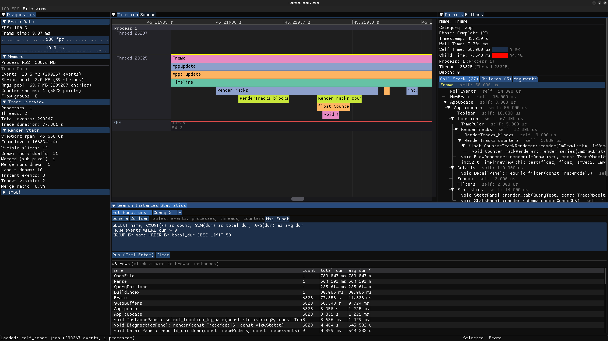
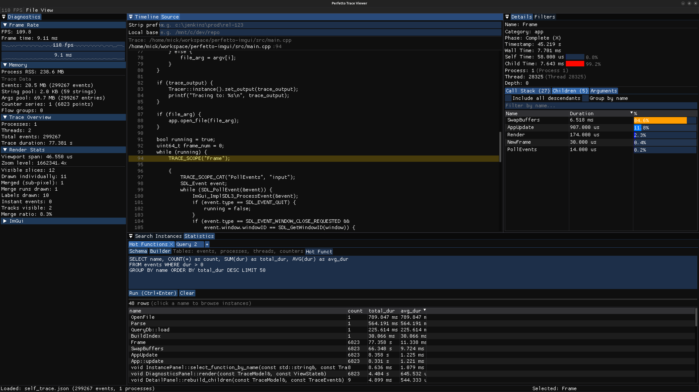
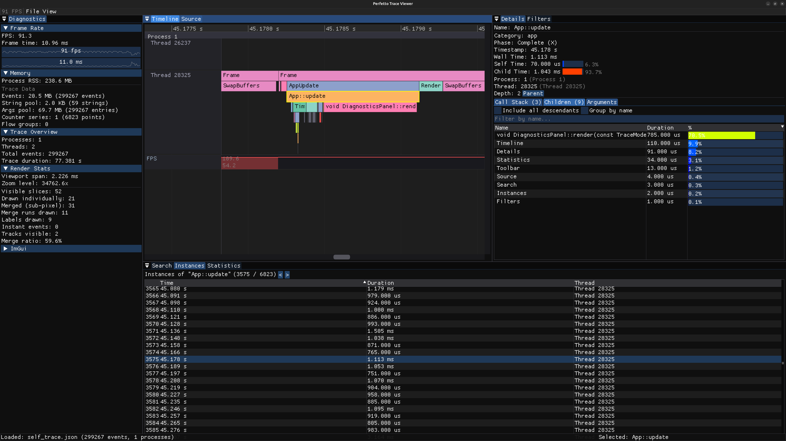

# TraceRender

A fast, native Chrome trace viewer built with C++ and [Dear ImGui](https://github.com/ocornut/imgui). Also runs in the browser via WebAssembly.





## Features

### Visualization
- **Timeline** — Zoomable/pannable timeline with colored slices per process/thread, sub-pixel culling, and collapsible process sections
- **Flame graph** — Per-thread icicle chart with zoom/breadcrumb navigation, range scoping, search highlighting, and selection sync
- **Counter tracks** — Auto-scaled step-function line charts for counter events with hover tooltips and sub-pixel point merging
- **Flow arrows** — Bezier curves connecting flow events across threads (toggleable)

### Inspection
- **Detail panel** — Tabbed inspector with Call Stack (collapsible descendant tree with wall/self/child time), Children breakdown (aggregated count, total, avg, min, max with heat-colored bars), and Arguments view
- **Range selection** — Click+drag on ruler or Shift+drag in tracks to select a time range with aggregated statistics
- **Instance browser** — List and navigate all instances of a selected function
- **Source viewer** — Jump to source code for traced functions with syntax highlighting, selectable/copyable text, and configurable path remapping for CI/cross-platform builds

### Search & Query
- **Search** — Case-insensitive search by event name or category with sortable results table, count/average columns, and unique-by-name deduplication
- **SQL queries** — Query trace events with SQLite, visual query builder with aggregate functions, schema inspector, multiple saved query tabs, and sortable results with async execution
- **Statistics** — Per-function aggregated timing with count, total, avg, min, max; CSV/TSV export

### Navigation & Controls
- **Filtering** — Toggle visibility of processes, threads, and categories via tree checkboxes
- **Go to time** — Jump to a specific timestamp (G key) supporting ns/us/ms/s units
- **Configurable keyboard shortcuts** — Rebindable primary and alternate bindings for all actions via Settings dialog
- **Keyboard shortcuts** — WASD call-stack navigation, arrow keys for pan/scroll, F to fit, G to go to time, Escape to deselect

### Application
- **Diagnostics** — Live render stats, FPS sparkline, memory usage history, sub-pixel culling metrics
- **Loading progress** — Four-phase progress display (reading file, parsing JSON, building index, building query DB)
- **Native file dialog** — OS file picker via SDL3, plus drag & drop support
- **Resizable label gutter** — Drag the splitter to resize thread labels
- **Memory counter** — Real-time RSS memory usage displayed in toolbar and as a counter track
- **Themes** — Dark and light themes with configurable font scale, track height, and selection border color
- **Self-profiling** — Emit an internal performance trace of the viewer itself with `--trace`

## Supported Format

[Chrome JSON Trace Event Format](https://docs.google.com/document/d/1CvAClvFfyA5R-PhYUmn5OOQtYMH4h6I0nSsKchNAySU) — both array (`[...]`) and object (`{"traceEvents": [...]}`) formats.

Supports event phases: X (complete), B/E (duration begin/end), i (instant), C (counter), s/t/f (flow), M (metadata), b/e/n (async), N/O/D (object), P (sample), R (mark).

### Sampled CPU profiles

`P` records are point observations. A top-level `stackFrames` object maps string IDs to frames with `name`, optional `category`, and optional `parent`. An event's `sf` identifies the leaf. Integer IDs also work. `stackFrames` may appear before or after `traceEvents`.

```json
{
  "traceEvents": [
    {"ph": "P", "name": "cpu", "ts": 100, "pid": 7, "tid": 11,
     "sf": "leaf", "weight": 250, "weightUnit": "us"}
  ],
  "stackFrames": {
    "root": {"name": "main", "category": "cpu"},
    "leaf": {"name": "work", "category": "cpu", "parent": "root"}
  }
}
```

Each `P` record counts as one sample. TraceRender keeps the raw `weight`; it does **not** assume an unqualified weight measures time. `weightUnit` is a TraceRender extension for converters that supply CPU-time weights. It accepts `ns`, `us`, `ms`, or `s` and normalizes estimates to microseconds. This unit is independent of the timestamp `-ns` option. Missing, negative, or unsupported time weights leave estimated CPU time unavailable. Zero is a valid explicit time weight. The interval to the next sample never becomes execution time, and `dur` on a `P` record is ignored. The Chrome format defines samples as zero-duration observations and supports `sf` ancestry. [Chrome trace format](https://docs.google.com/document/d/1CvAClvFfyA5R-PhYUmn5OOQtYMH4h6I0nSsKchNAySU)

Missing frame IDs, invalid frame definitions, missing ancestors, and cycles leave the entire stack unresolved. The observation, timestamp, process/thread identity, raw reference, and weight remain available under the event's supplied name. Valid samples use the leaf frame's name for navigation. Duplicate frame IDs use the last definition. Inline `stack` program-counter arrays and the separate top-level `samples` format are not imported by this implementation.

Converted `B`/`E` or `X` records with the category token `sampleEvent` are sampled spans. Their supplied intervals are estimated sampled CPU time, and their original sample count is unavailable. In mixed B/E streams, mark both transitions with `sampleEvent` so measured and sampled pairs stay independent. This matches [PerfView's Chromium exporter](https://github.com/microsoft/perfview/blob/main/src/TraceEvent/Stacks/ChromiumStackSourceWriter.cs). Unmarked duration records retain measured-event semantics. Equal timestamps and intervals retain input order; same-name recursive frames remain distinct.

The flame graph creates separate measured, sample, and sampled-span trees per thread. Sample-tree widths represent sample counts, with inclusive/exclusive counts and available CPU estimates in tooltips. Time-weight coverage is shown when some samples lack estimates. Range selection includes observations in `[start, end)` and clips span intervals. Per-function range counts include a recursive function once per observation; flame trees preserve each recursive stack position. Search averages use only measured events. Details, instances, and timeline tooltips label estimates explicitly.

SQL exposes `kind`, `sample_count`, `sample_weight`, `weight_unit`, `estimated_cpu_time`, `estimated_self_cpu_time`, and the raw `sf`. `dur` and `self_time` are NULL for sampled records. Original sample counts are NULL for converted spans. CPU estimates for raw samples belong to the observed leaf; the flame and range views calculate inclusive ancestry. Group queries by `kind` to keep observations and converted spans separate. Existing duration queries continue to select measured events.

TraceRender opens `.diagsession` files directly on Linux through File > Open, drag and drop, or a command-line path. Import runs locally with progress and cancellation. File > Save Profile creates a versioned `.trprofile` that preserves CPU observations, resolved names and source locations, allocation histories, managed GC observations and snapshots, and capture quality. Reopening needs neither the original capture nor symbol files. See [the desktop import workflow](docs/diagsession-import.md#desktop-workflow) and [the version 1 format](docs/profile-format.md).

Native CPU and allocation frames can share [local PDB resolution through LLVM 18.1](docs/native-symbols.md). Matching PDB GUID/age is required; missing symbols keep module offsets. Saved resolutions reopen without PDBs. Native flame and range views group by function identity, so unrelated functions with the same display name remain separate.

The committed fixtures in `tests/fixtures/` use invented functions and timestamps:

- `sampled_stacks.json` contains `main -> work` at 100 us with 250 us weight and `main` at 10,000 us with 500 us weight on thread 11. The root has two inclusive samples, one exclusive sample, and 750 us estimated CPU. Thread 12 has a separate unweighted observation. The gaps contribute no CPU time. Tests import both field orders.
- `perfview_spans.json` contains a recursive outer frame from 0 to 10 us and two inner spans from 0 to 5 and 5 to 10 us. The outer estimate is 10 us inclusive and zero self; no original sample counts are inferred.

Supported `.diagsession` producers and recording modes are listed in the [fixture corpus](docs/diagsession-corpus.md).

## Building

### Desktop

Requires CMake 3.22+, a C++17 compiler, and OpenGL development headers.

```bash
# Install dependencies (Ubuntu/Debian)
sudo apt install build-essential cmake libgl-dev

# Build
cmake -B build -DCMAKE_BUILD_TYPE=Release
cmake --build build -j$(nproc)
```

All other dependencies (SDL3, Dear ImGui, nlohmann/json, SQLite3) are fetched automatically via CMake FetchContent.

### WebAssembly

Requires [Emscripten](https://emscripten.org/).

```bash
./scripts/build_wasm.sh
```

## Usage

```bash
# Open with file dialog
./build/trace_render

# Open a trace file directly
./build/trace_render trace.json

# Interpret timestamps as nanoseconds (default is microseconds)
./build/trace_render -ns trace.json

# Explicitly interpret timestamps as microseconds
./build/trace_render -us trace.json

# Self-profiling: emit an internal trace of the viewer itself
./build/trace_render --trace output.json trace.json
```

You can also drag & drop a trace file onto the window.

### Outstanding memory

The Memory tab uses recorded native or managed allocation histories from `.diagsession` and `.trprofile` files. It defaults to the capture end. Set T in microseconds or use a selected event's time, then select a function to inspect its allocation paths. The birth filter selects allocations born at or after its start and before its end that remain outstanding at T. You can copy the timeline range into that filter or clear it to include earlier allocations.

Known bytes and allocation counts include intentional retention. Records with an unknown start or end, sampled allocation events, and capture gaps are shown separately as uncertain. These numbers describe recorded allocations, not process RAM or total allocation traffic. Inclusive function rows overlap because each call path contributes to several functions; the summary counts each allocation once.

Managed GC checkpoints bound observed survival and absence; they do not supply exact release times. The checked Desktop CLR 4 capture supports survival analysis. CoreCLR allocation stacks remain available, but survival is unknown because the checked .NET 8 capture contradicts its retained-object checks. See [managed allocation coverage](docs/managed-allocations.md).

Select an allocation path to see its frames. **View source** opens saved source locations in the existing Source tab, including in profiles without CPU events. Missing symbols remain visible as addresses, and source path remapping works as it does for trace events. Captures with several memory capabilities offer a view selector. [Managed heap snapshots](docs/managed-snapshots.md) show recorded type counts and sizes; they cannot identify allocating functions or allocation birth times.

### Controls

| Action | Input |
|--------|-------|
| Zoom in/out | Mouse wheel / =/- keys |
| Pan horizontally | Middle-click drag / Ctrl+left drag / Left/Right arrows |
| Scroll vertically | Shift+mouse wheel / Up/Down arrows |
| Navigate to parent | W |
| Navigate to first child | S |
| Navigate to prev sibling | A |
| Navigate to next sibling | D |
| Select event | Left click |
| Select time range | Click+drag on ruler / Shift+drag in tracks |
| Fit to selection/range | F |
| Fit entire trace | F (with nothing selected) |
| Go to time | G |
| Clear selection | Escape |
| Open file | Ctrl+O |
| Search | Ctrl+F |
| Settings | Ctrl+, |
| Run SQL query | Ctrl+Enter |

All keyboard shortcuts can be customized in Settings > Keyboard.

## Architecture

```
src/
  main.cpp                       Entry point: SDL3/OpenGL init, main loop
  app.h / app.cpp                App shell: dockspace, panel orchestration, settings
  tracing.h                      Self-profiling tracer (Chrome JSON output)

  model/
    trace_event.h                TraceEvent, StackFrame, Phase and EventKind
    trace_model.h / .cpp         Events, string pool, processes/threads, indexes
    block_index.h                256-event block spatial index for range queries
    color_palette.h              48-color hash-based category coloring
    query_db.h / .cpp            SQLite database with async query execution

  parser/
    trace_parser.h / .cpp        SAX streaming JSON parser (handles 100MB+ files)

  platform/
    platform.h                   Platform interface (GL, file dialogs, main loop)
    platform_desktop.cpp         SDL3/OpenGL 3.3 desktop implementation
    platform_wasm.cpp            Emscripten/WebGL2 implementation
    file_loader.h                Async file loading interface
    file_loader_desktop.cpp      Threaded background loader
    file_loader_wasm.cpp         Synchronous loader
    memory.h                     Cross-platform RSS memory query

  ui/
    view_state.h                 Viewport, selection, filters, layout state
    timeline_view.h / .cpp       Time ruler, tracks, event rendering, zoom/pan
    detail_panel.h / .cpp        Call stack, children, arguments inspector
    search_panel.h / .cpp        Text search with sortable results
    filter_panel.h / .cpp        Process/thread/category visibility toggles
    stats_panel.h / .cpp         SQL editor, query builder, result tables
    flame_graph_panel.h / .cpp   Per-thread icicle charts
    instance_panel.h / .cpp      Function instance lister with navigation
    source_panel.h / .cpp        Source code viewer with path remapping
    diagnostics_panel.h / .cpp   FPS/memory sparklines, render stats
    counter_track.h / .cpp       Step-function counter visualization
    flow_renderer.h / .cpp       Bezier flow arrows across threads
    toolbar.h / .cpp             Menu bar: file open, zoom, settings
    range_stats.h / .cpp         Aggregated statistics for time ranges
    key_bindings.h / .cpp        Configurable keyboard shortcut system
    format_time.h                Auto-scaling time display (ns/us/ms/s)
    export_utils.h               CSV/TSV export with RFC 4180 quoting
    string_utils.h               Case-insensitive search
    sort_utils.h                 ImGui table sort comparators
```

### Key Design Decisions

- **SAX parser** (not DOM) — Streams events without building a JSON tree, handles large traces (100MB+)
- **String-interned events** — Names and categories stored once in a pool, events reference by index
- **Block-based spatial index** — Fast visible-range queries with O(log N + K) performance using 256-event blocks with monotonic max_end_ts propagation
- **Pre-computed derived data** — Parent indices, self times, nesting depths, and category sets computed once during `build_index()`, not per-frame
- **ImDrawList rendering** — Direct draw commands for thousands of slices at 60fps, bypassing ImGui widget overhead
- **Sub-pixel culling** — Slices narrower than 1px merged into thin lines per-depth to prevent overdraw
- **Lazy JSON parsing** — Event arguments stored as raw JSON strings, deserialized on demand one event at a time
- **Async SQL execution** — Non-blocking query execution with progress tracking on a background thread
- **Platform abstraction** — Desktop (SDL3/OpenGL 3.3) and WebAssembly (Emscripten/WebGL2) share the same codebase via compile-time platform switching
- **Flat node pools** — Flame graph uses index-based trees (no pointers) for cache-friendly traversal and safe rebuilds

### Dependencies

All fetched automatically via CMake FetchContent:

| Dependency | Version | Purpose |
|-----------|---------|---------|
| [Dear ImGui](https://github.com/ocornut/imgui) | docking branch | UI framework |
| [SDL3](https://github.com/libsdl-org/SDL) | 3.2.8 | Windowing, input, OpenGL context |
| [nlohmann/json](https://github.com/nlohmann/json) | 3.11.3 | SAX JSON parsing |
| [SQLite](https://sqlite.org) | 3.45.1 | SQL query engine |
| [Google Test](https://github.com/google/googletest) | 1.15.2 | Unit testing (desktop only) |

## Testing

```bash
./scripts/run_tests.sh
```

Uses Google Test covering: parser, trace model, spatial index, time formatting, viewport state, search, timeline hit testing, trace events, counter tracks, source path remapping, SQL queries, CSV/TSV export, self-profiling tracer, flame graph, sampled profiles and mixed metrics, and panel reset lifecycle.

## Generating Test Traces

```bash
# Generate a synthetic trace for stress testing
python3 scripts/gen_trace.py > trace.json
```

## License

MIT
